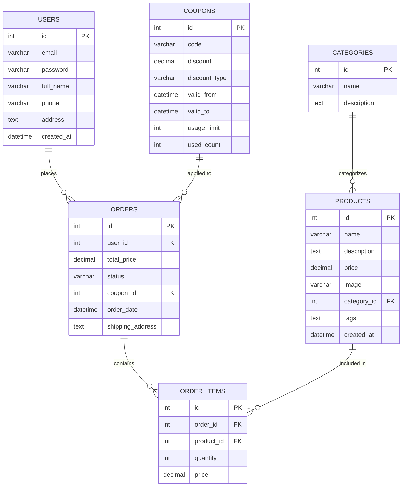

# 🌸 FlowersGiftNow - Website Bán Hoa & Quà Tặng 🎁


> **Dự án Lập Trình Web - Nhóm 6**  
> Website thương mại điện tử chuyên về hoa tươi và quà tặng, được xây dựng với PHP thuần và MySQL.

---

## 📋 Mục Lục

- [Giới Thiệu](#-giới-thiệu)
- [Tính Năng](#-tính-năng)
- [Công Nghệ Sử Dụng](#-công-nghệ-sử-dụng)
- [Cài Đặt](#-cài-đặt)
- [Cấu Trúc Thư Mục](#-cấu-trúc-thư-mục)
- [Cơ Sở Dữ Liệu](#-cơ-sở-dữ-liệu)
- [API Endpoints](#-api-endpoints)
- [Screenshots](#-screenshots)
- [Đóng Góp](#-đóng-góp)
- [Giấy Phép](#-giấy-phép)
- [Liên Hệ](#-liên-hệ)

---

## 🌟 Giới Thiệu

**FlowersGiftNow** là một website thương mại điện tử chuyên nghiệp, được thiết kế để cung cấp dịch vụ bán hoa tươi và quà tặng trực tuyến. Website được phát triển nhằm mang đến trải nghiệm mua sắm thuận tiện và dễ dàng cho khách hàng.

### 🎯 Mục Tiêu Dự Án
- Tạo ra một nền tảng thương mại điện tử hiện đại và thân thiện với người dùng
- Cung cấp hệ thống quản lý sản phẩm và đơn hàng hiệu quả
- Xây dựng giao diện đẹp mắt, responsive trên mọi thiết bị
- Tích hợp hệ thống thanh toán và quản lý khuyến mãi

### 🏆 Đặc Điểm Nổi Bật
- **Giao diện hiện đại**: Thiết kế responsive, tương thích mọi thiết bị
- **Hiệu suất cao**: Tối ưu hóa tốc độ tải trang và trải nghiệm người dùng  
- **Bảo mật**: Xử lý dữ liệu an toàn, mã hóa thông tin nhạy cảm
- **Quản lý dễ dàng**: Panel admin trực quan, báo cáo chi tiết

---

## ✨ Tính Năng

### 🛒 Dành Cho Khách Hàng
- **Duyệt sản phẩm**: Xem danh sách hoa và quà tặng với hình ảnh chất lượng cao
- **Tìm kiếm & lọc**: Tìm kiếm theo tên, lọc theo giá, danh mục, thẻ tag
- **Giỏ hàng thông minh**: Thêm, xóa, cập nhật số lượng sản phẩm dễ dàng
- **Mã giảm giá**: Áp dụng coupon để được ưu đãi khi thanh toán
- **Theo dõi đơn hàng**: Kiểm tra trạng thái đơn hàng theo mã tracking
- **Tài khoản cá nhân**: Đăng ký, đăng nhập, quản lý thông tin và lịch sử mua hàng

### 👨‍💼 Dành Cho Quản Trị Viên
- **Dashboard thống kê**: Báo cáo doanh thu, đơn hàng, sản phẩm bán chạy
- **Quản lý sản phẩm**: Thêm, sửa, xóa sản phẩm, upload hình ảnh
- **Quản lý đơn hàng**: Xem chi tiết, cập nhật trạng thái đơn hàng
- **Quản lý coupon**: Tạo và quản lý mã giảm giá, theo dõi hiệu quả
- **Báo cáo chi tiết**: Thống kê doanh thu theo ngày, sản phẩm hot trend

### 🔧 Tính Năng Kỹ Thuật
- **Responsive Design**: Tương thích hoàn hảo trên desktop, tablet, mobile
- **SEO Friendly**: URL thân thiện, meta tags tối ưu
- **Ajax Loading**: Cập nhật giỏ hàng không cần reload trang
- **Image Optimization**: Tối ưu hóa hình ảnh cho tốc độ tải nhanh
- **Security**: Bảo vệ chống SQL Injection, XSS, CSRF

---

## 🛠 Công Nghệ Sử Dụng

### Backend
- **PHP 7.4+**: Ngôn ngữ lập trình chính
- **MySQL 8.0+**: Hệ quản trị cơ sở dữ liệu
- **PDO**: Thư viện kết nối database an toàn

### Frontend  
- **HTML5 & CSS3**: Cấu trúc và styling website
- **Bootstrap 5.3**: Framework CSS responsive
- **JavaScript (Vanilla)**: Xử lý tương tác người dùng
- **jQuery**: Thư viện JavaScript hỗ trợ
- **Font Awesome**: Bộ icon vector chuyên nghiệp

### Tools & Libraries
- **XAMPP/WAMP**: Môi trường phát triển local
- **Git**: Quản lý version control
- **Composer**: Quản lý dependencies (nếu có)

---

## 🚀 Cài Đặt

### 📋 Yêu Cầu Hệ Thống
- PHP 7.4 trở lên
- MySQL 8.0 trở lên  
- Apache/Nginx Web Server
- Dung lượng ổ cứng: tối thiểu 100MB

### 🔧 Hướng Dẫn Cài Đặt Chi Tiết

#### Bước 1: Clone Repository
```bash
git clone https://github.com/tqd-tech/LTW_FlowersGiftNow_Group6.git
cd LTW_FlowersGiftNow_Group6
```

#### Bước 2: Cấu Hình Web Server
**Đối với XAMPP:**
```bash
# Copy project vào thư mục htdocs
cp -r LTW_FlowersGiftNow_Group6 /xampp/htdocs/
```

**Đối với WAMP:**
```bash
# Copy project vào thư mục www  
cp -r LTW_FlowersGiftNow_Group6 /wamp64/www/
```

#### Bước 3: Tạo Database
1. Truy cập phpMyAdmin: `http://localhost/phpmyadmin`
2. Tạo database mới: `if0_39416227_flower_shop`
3. Import file SQL (nếu có) hoặc tạo tables theo cấu trúc bên dưới

#### Bước 4: Cấu Hình Database
Chỉnh sửa file `includes/db.php`:
```php
<?php
$host = 'localhost';           // Host database
$db   = 'if0_39416227_flower_shop';  // Tên database
$user = 'root';                // Username
$pass = '';                    // Password (để trống với XAMPP)
$charset = 'utf8mb4';

try {
    $pdo = new PDO("mysql:host=$host;dbname=$db;charset=utf8mb4", $user, $pass);
    $pdo->setAttribute(PDO::ATTR_ERRMODE, PDO::ERRMODE_EXCEPTION);
} catch(PDOException $e) {
    die("Lỗi kết nối: " . $e->getMessage());
}
?>
```

#### Bước 5: Chạy Website  
1. Khởi động Apache và MySQL trong XAMPP/WAMP
2. Truy cập: `http://localhost/LTW_FlowersGiftNow_Group6`
3. Panel admin: `http://localhost/LTW_FlowersGiftNow_Group6/admin`

---

## 📁 Cấu Trúc Thư Mục

```
LTW_FlowersGiftNow_Group6/
│
├── 📁 admin/                    # Khu vực quản trị
│   ├── dashboard.php           # Trang tổng quan
│   ├── products.php            # Quản lý sản phẩm  
│   ├── orders.php              # Quản lý đơn hàng
│   ├── coupons.php             # Quản lý mã giảm giá
│   └── reports.php             # Báo cáo thống kê
│
├── 📁 assets/                   # Tài nguyên tĩnh
│   ├── 📁 css/                 # File CSS
│   │   ├── main.css            # CSS chính
│   │   └── util.css            # CSS utilities
│   ├── 📁 js/                  # File JavaScript  
│   │   ├── main.js             # JS chính
│   │   └── slick-custom.js     # Slider custom
│   ├── 📁 images/              # Hình ảnh
│   │   ├── 📁 flowers/         # Hình hoa
│   │   ├── 📁 gifts/           # Hình quà tặng
│   │   └── 📁 icons/           # Icons
│   └── 📁 fonts/               # Fonts chữ
│
├── 📁 includes/                 # Files include
│   ├── db.php                  # Kết nối database
│   ├── header.php              # Header chung
│   └── footer.php              # Footer chung
│
├── 📁 user/                     # Khu vực người dùng
│   ├── login.php               # Đăng nhập
│   ├── register.php            # Đăng ký
│   ├── profile.php             # Hồ sơ cá nhân
│   └── orders.php              # Lịch sử đơn hàng
│
├── index.php                   # Trang chủ
├── product.php                 # Chi tiết sản phẩm
├── cart.php                    # Giỏ hàng
├── checkout.php                # Thanh toán
├── track_order.php             # Theo dõi đơn hàng
├── apply_coupon.php            # Áp dụng mã giảm giá
├── README.md                   # File này
└── CONTRIBUTING.md             # Hướng dẫn đóng góp
```

---

## 🗄 Cơ Sở Dữ Liệu

### Sơ Đồ ERD


### Chi Tiết Tables

#### 🏷 Table: users
```sql
CREATE TABLE users (
    id INT PRIMARY KEY AUTO_INCREMENT,
    email VARCHAR(255) UNIQUE NOT NULL,
    password VARCHAR(255) NOT NULL,
    full_name VARCHAR(255) NOT NULL,
    phone VARCHAR(20),
    address TEXT,
    created_at TIMESTAMP DEFAULT CURRENT_TIMESTAMP
);
```

#### 📦 Table: products  
```sql
CREATE TABLE products (
    id INT PRIMARY KEY AUTO_INCREMENT,
    name VARCHAR(255) NOT NULL,
    description TEXT,
    price DECIMAL(10,2) NOT NULL,
    image VARCHAR(255),
    category_id INT NOT NULL,
    tags TEXT,
    created_at TIMESTAMP DEFAULT CURRENT_TIMESTAMP,
    FOREIGN KEY (category_id) REFERENCES categories(id)
);
```

#### 🛒 Table: orders
```sql
CREATE TABLE orders (
    id INT PRIMARY KEY AUTO_INCREMENT,
    user_id INT,
    total_price DECIMAL(10,2) NOT NULL,
    status ENUM('pending', 'processing', 'shipped', 'delivered') DEFAULT 'pending',
    coupon_id INT,
    order_date TIMESTAMP DEFAULT CURRENT_TIMESTAMP,
    shipping_address TEXT,
    FOREIGN KEY (user_id) REFERENCES users(id),
    FOREIGN KEY (coupon_id) REFERENCES coupons(id)
);
```

---

## 🔌 API Endpoints

### 🛒 Cart Management
| Method | Endpoint | Mô tả |
|--------|----------|--------|
| POST | `/add_to_cart.php` | Thêm sản phẩm vào giỏ |
| POST | `/update_cart.php` | Cập nhật số lượng |
| POST | `/remove_from_cart.php` | Xóa khỏi giỏ hàng |

### 💰 Coupon System
| Method | Endpoint | Mô tả |
|--------|----------|--------|
| POST | `/apply_coupon.php` | Áp dụng mã giảm giá |
| POST | `/apply_coupon.php?remove=1` | Xóa mã giảm giá |

### 📋 Order Tracking
| Method | Endpoint | Mô tả |
|--------|----------|--------|
| GET | `/track_order.php?code={tracking_code}` | Theo dõi đơn hàng |
| POST | `/track_search.php` | Tìm kiếm đơn hàng |

### 👤 User Management
| Method | Endpoint | Mô tả |
|--------|----------|--------|
| POST | `/user/login.php` | Đăng nhập |
| POST | `/user/register.php` | Đăng ký tài khoản |
| GET | `/user/profile.php` | Xem hồ sơ |
| GET | `/user/orders.php` | Lịch sử đơn hàng |

---

## 📱 Screenshots

### 🏠 Trang Chủ
- Slider banner với hình ảnh hoa đẹp mắt
- Danh sách sản phẩm được sắp xếp theo lưới responsive
- Bộ lọc và tìm kiếm thông minh

### 🛒 Giỏ Hàng & Thanh Toán  
- Giao diện giỏ hàng trực quan, dễ sử dụng
- Áp dụng mã giảm giá với thông báo real-time
- Form thanh toán đơn giản, bảo mật

### 👨‍💼 Admin Panel
- Dashboard với biểu đồ và thống kê tổng quan
- Quản lý sản phẩm với upload hình ảnh
- Theo dõi đơn hàng và báo cáo doanh thu

---

## 👥 Đội Ngũ Phát Triển

| Avatar | Tên | Vai Trò | Nhiệm Vụ Chính |
|--------|-----|---------|----------------|
| 👨‍💻 | **Trần Quang Dũng** | Team Leader | Quản lý dự án, merge code, database design |
| 🎨 | **Nguyễn Trường Lâm** | Frontend Developer | UI/UX trang chủ, responsive design |
| 🖼 | **Nguyễn Lê Tuấn** | Frontend Developer | Giao diện sản phẩm, giỏ hàng |
| ⚙️ | **Hoàng Nguyên Soái** | Backend Developer | Authentication, user management |
| 🔧 | **Vũ Minh Quang** | Backend Developer | API sản phẩm, xử lý đơn hàng |

---

## 🤝 Đóng Góp

Chúng tôi rất hoan nghênh mọi đóng góp để cải thiện dự án! 

### 📝 Quy Trình Đóng Góp
1. **Fork** repository này
2. **Clone** về máy local: `git clone <your-fork-url>`
3. Tạo **branch mới**: `git checkout -b feature/ten-tinh-nang`
4. **Commit** thay đổi: `git commit -m '[Feature] Mô tả ngắn gọn'`
5. **Push** lên branch: `git push origin feature/ten-tinh-nang`
6. Tạo **Pull Request** với mô tả chi tiết

### 🎯 Các Khu Vực Cần Đóng Góp
- 🐛 **Bug fixes**: Sửa lỗi hiện tại
- ✨ **New features**: Thêm tính năng mới
- 📚 **Documentation**: Cải thiện tài liệu
- 🎨 **UI/UX**: Tối ưu giao diện người dùng  
- ⚡ **Performance**: Tối ưu hiệu suất

### 📋 Coding Standards
- Sử dụng **PSR-4** cho PHP
- **Indentation**: 4 spaces
- **Naming**: camelCase cho variables, PascalCase cho classes
- **Comments**: Tiếng Việt hoặc Tiếng Anh đều được

Xem chi tiết tại [CONTRIBUTING.md](CONTRIBUTING.md)

---

## 📜 Giấy Phép

Dự án này được phân phối dưới giấy phép **MIT License**. Xem chi tiết tại [LICENSE](LICENSE).

```
MIT License

Copyright (c) 2025 FlowersGiftNow Team

Permission is hereby granted, free of charge, to any person obtaining a copy
of this software and associated documentation files (the "Software"), to deal
in the Software without restriction, including without limitation the rights
to use, copy, modify, merge, publish, distribute, sublicense, and/or sell
copies of the Software...
```

---

## 🌐 Demo & Liên Hệ

### 🔗 Links Quan Trọng
- **🌍 Website Demo**: `http://localhost/LTW_FlowersGiftNow_Group6`
- **⚙️ Admin Panel**: `http://localhost/LTW_FlowersGiftNow_Group6/admin`
- **📂 GitHub Repository**: [LTW_FlowersGiftNow_Group6](https://github.com/tqd-tech/LTW_FlowersGiftNow_Group6)

### 📞 Thông Tin Liên Hệ
- **📧 Email**: tqd.tech@gmail.com
- **📱 Phone**: +84 XXX XXX XXX
- **🏫 Trường**: Đại học Giao Thông Vận Tải TP.HCM

---

## 🏆 Thành Tựu & Ghi Nhận

### ⭐ Điểm Nổi Bật
- ✅ **100% Responsive** trên mọi thiết bị
- ✅ **Security First** với các biện pháp bảo mật hiện đại  
- ✅ **User-Friendly** giao diện trực quan, dễ sử dụng
- ✅ **Performance Optimized** tốc độ tải nhanh
- ✅ **SEO Ready** chuẩn SEO, tối ưu công cụ tìm kiếm

### 🎖 Công Nghệ Áp Dụng
- **MVC Pattern**: Kiến trúc mã nguồn rõ ràng
- **Prepared Statements**: Bảo vệ chống SQL Injection
- **Session Security**: Quản lý phiên đăng nhập an toàn
- **Image Optimization**: Tối ưu hình ảnh cho web
- **Responsive Grid**: Layout linh hoạt mọi màn hình

---

## 📈 Kế Hoạch Phát Triển

### 🔮 Tính Năng Sắp Tới (v2.0)
- [ ] 💳 **Tích hợp thanh toán online** (VNPay, Momo)
- [ ] 🔔 **Hệ thống thông báo** real-time  
- [ ] 📱 **Mobile App** (React Native)
- [ ] 🤖 **Chatbot** hỗ trợ khách hàng
- [ ] 📊 **Advanced Analytics** với Chart.js
- [ ] 🌍 **Multi-language** hỗ trợ đa ngôn ngữ

### 🚀 Cải Tiến Hiệu Suất
- [ ] ⚡ **Caching System** với Redis
- [ ] 🗄 **Database Optimization** với indexing
- [ ] 🖼 **CDN Integration** cho hình ảnh
- [ ] 📦 **Lazy Loading** cho sản phẩm

---

<div align="center">

## 💝 Cảm Ơn

**Cảm ơn bạn đã quan tâm đến dự án FlowersGiftNow!**

Nếu bạn thấy dự án này hữu ích, hãy ⭐ **star** repository để ủng hộ team nhé!

---

*Made with ❤️ by Group 6 - University of Transport Ho Chi Minh City*

</div>
